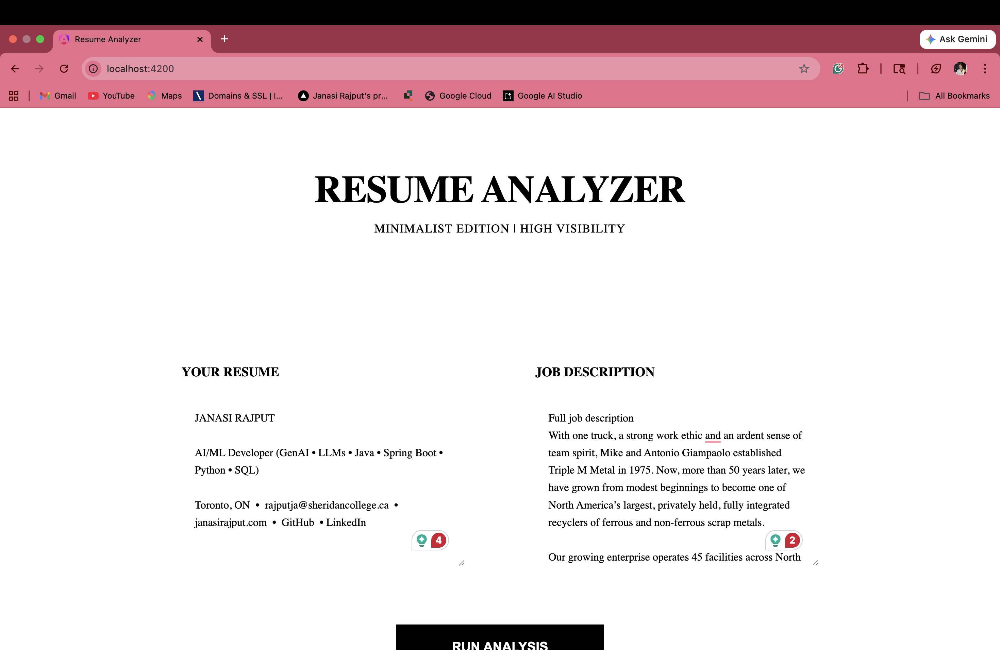
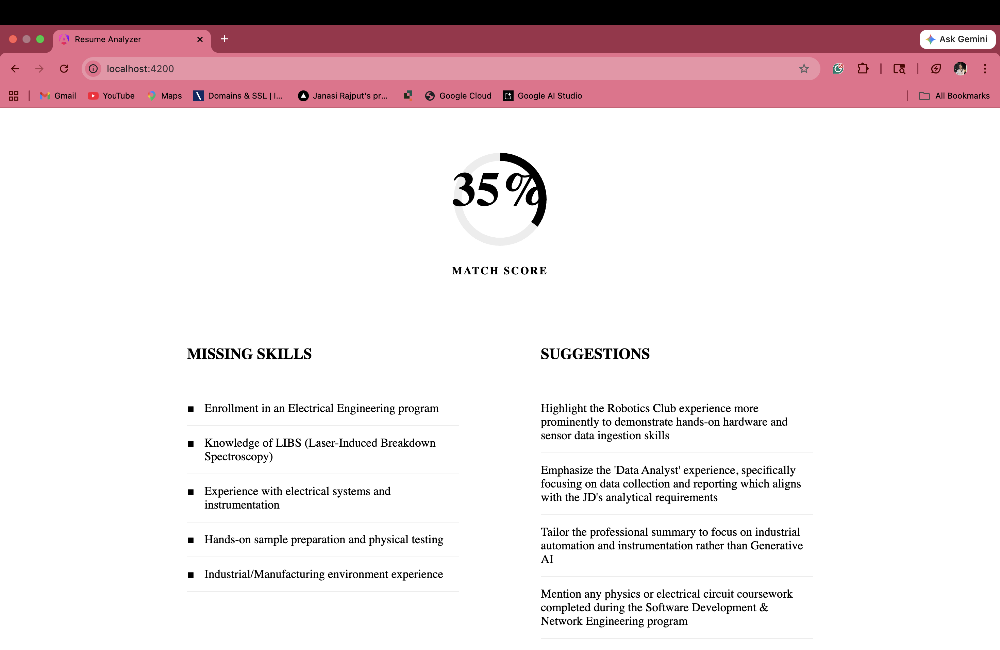

# 🚀 AI Resume Analyzer

A high-performance, full-stack AI application designed to revolutionize the job application process. Built with **Spring Boot**, **Spring AI (Gemini)**, and **Angular**, this tool provides real-time, deep-thinking analysis of resumes against job descriptions.

## ✨ Key Features
- **Instant Match Scoring**: Get a percentage-based compatibility score between your resume and the job description.
- **Skill Gap Analysis**: Automatically identifies missing keywords and essential skills required for the role.
- **AI-Powered Suggestions**: Provides actionable feedback to improve resume content and structure.
- **Fast vs. Deep Thinking Modes**: Toggle between rapid analysis and thorough evaluation using Google Gemini.




## 🛠️ Technology Stack
- **Backend**: Java 21, Spring Boot 3.4.2, Spring AI
- **AI Engine**: Google Gemini (Flash & Pro models)
- **Frontend**: Angular (Integrated in `src/main/webapp`)
- **CI/CD**: GitHub Actions (Maven Publishing)

## 🔒 Security Best Practices
> [!IMPORTANT]
> **Never commit your API keys to version control.**
> This project is configured to use environment variables for sensitive information. 

### How to set your API Key:
1.  **Local Development**: Set the `GOOGLE_GENAI_API_KEY` environment variable on your machine.
    ```bash
    export GOOGLE_GENAI_API_KEY='your_api_key_here'
    ```
2.  **GitHub Actions**: Add your key to **GitHub Repository Secrets** as `GOOGLE_GENAI_API_KEY`.

## 🚀 Getting Started
1. Clone the repository.
2. Ensure you have Java 21 installed.
3. Set your environment variable: `GOOGLE_GENAI_API_KEY`.
4. Run the application using Maven:
   ```bash
   ./mvnw spring-boot:run
   ```

## 🌐 Connect with Me
[](YOUR_LINKEDIN_URL_HERE)

---
*Created with ❤️ for the "Teach Me Something" presentation series.*
